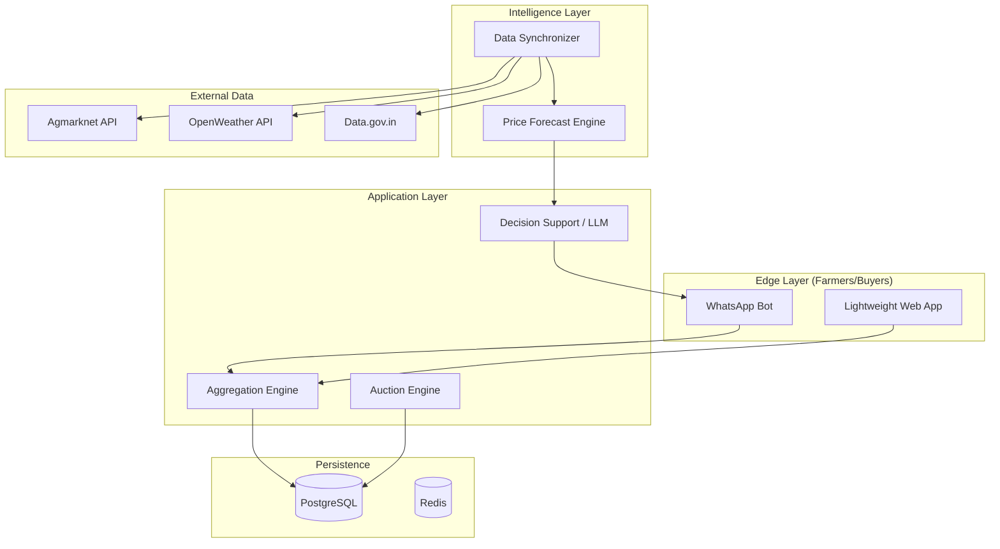

# Design Document: Village Price Power (VPP)
## AI-Powered Collective Auction & Fair-Price Intelligence for Farmers

---

## 1. Executive Summary
**Village Price Power (VPP)** is a digital platform designed to shift the power dynamic in Indian agriculture from "Price Takers" to "Price Makers." By leveraging AI-driven forecasting and micro-level digital aggregation, VPP enables small farmers to pool their produce into high-value lots and sell via a transparent, sealed-bid auction system, effectively bypassing trader cartels.

---

## 2. System Architecture
The system follows a modular, cloud-native architecture optimized for low-bandwidth rural environments.

### 2.1 High-Level Architecture Diagram

---

## 3. Core Modules

### 3.1 Micro-Coop Aggregation Engine
*   **Purpose:** Dynamically groups individual farmer harvests into a single "Marketable Lot."
*   **Logic:** Uses proximity-based clustering (geofencing) and commodity matching.
*   **Outcome:** Converts 50 farmers with 20kg each into a 1-ton high-volume lot that attracts premium institutional buyers.

### 3.2 AI Fair-Price Predictor (The Price Band)
*   **Model:** Time-series forecasting (Prophet or LSTM).
*   **Inputs:** 
    *   Historical Mandi Prices (Agmarknet).
    *   Arrival Volumes (Market supply signals).
    *   Weather Forecasts (Supply disruption signals).
*   **Output:** A price band (Lower-Bound to Upper-Bound) with a Confidence Score.

### 3.3 Sealed-Bid Auction Engine
*   **Mechanism:** First-price sealed-bid auction.
*   **Anti-Collusion:** Bids are hidden until the timer expires. Prevents "Price Signaling" where traders talk to each other to keep bids low.
*   **Identity:** Buyers are verified and rated based on payment history.

### 3.4 Explainable AI (LLM Layer)
*   **Purpose:** Translates complex data into simple, actionable advice in local languages.
*   **Example Prompt:** *"The current predicted band is ₹20. Weather reports show heavy rain in neighboring districts tomorrow, which will reduce supply. Recommendation: Wait 24 hours to sell to capture a likely ₹2/kg increase."*

---

## 4. Technical Stack

| Component         | Technology                          | Rationale                                   |
|-------------------|-------------------------------------|---------------------------------------------|
| **Frontend**      | React + Tailwind CSS (PWA)         | Fast, mobile-responsive, works offline.     |
| **Mobile Entry**  | Twilio WhatsApp API                 | Highest accessibility for rural users.      |
| **Backend**       | FastAPI (Python)                    | High performance, async ML integration.     |
| **Database**      | PostgreSQL                          | Reliable relational data for auctions.      |
| **ML Libraries**  | Scikit-learn, Prophet, PyTorch      | Robust time-series and predictive tools.     |
| **Generative AI** | OpenAI GPT-4o / Claude 3.5 Sonnet   | Superior reasoning for decision support.    |

---

## 5. Data Strategy

### 5.1 Training Data (Public)
*   **Agmarknet:** 5-10 years of daily commodity price/arrival data.
*   **OpenWeather:** Rainfall/Temperature correlation with harvest dips.

### 5.2 Simulation Data (Synthetic)
*   **Buyer Behavior:** Simulating cartel behavior vs. competitive bidding to demonstrate the value of sealed bids.
*   **Logistics:** Estimating "Farm-to-Village-Point" transport costs to net-calculate farmer profit.

---

## 6. User Experience (UX) Flow

### 6.1 The Farmer's Journey
1.  **Notification:** Farmer receives a WhatsApp message: *"Onion harvest season is starting."*
2.  **Listing:** Farmer replies: *"Onion, 200kg, Ready in 2 days."*
3.  **Aggregation:** System confirms: *"You are now part of Village Lot #402 (Current Size: 1.2 Tons)."*
4.  **Intelligence:** *"Fair Price predicted: ₹18-₹21. Currently, buyers are bidding ₹16. Recommendation: Hold for 2 days."*
5.  **Execution:** Auction ends. Farmer receives: *"Lot sold at ₹20.20 via Auction. Proceed to Collection Center."*

---

## 7. Success Metrics (KPIs)
*   **Harvest Realization:** Average price increase vs. local Mandi price.
*   **Aggregated Volume:** Total tonnage managed via digital micro-coops.
*   **Buyer Competition:** Number of unique bids per lot.
*   **Decision Accuracy:** Percentage of AI "Wait vs. Sell" recommendations that resulted in higher profit.

---

## 8. Scalability & Impact
*   **Economic:** Increases farmer income by 5-15%.
*   **Social:** Reduces the mental burden of price uncertainty.
*   **Technological:** Proves that AI can empower the smallest units of production through collective digital intelligence.
